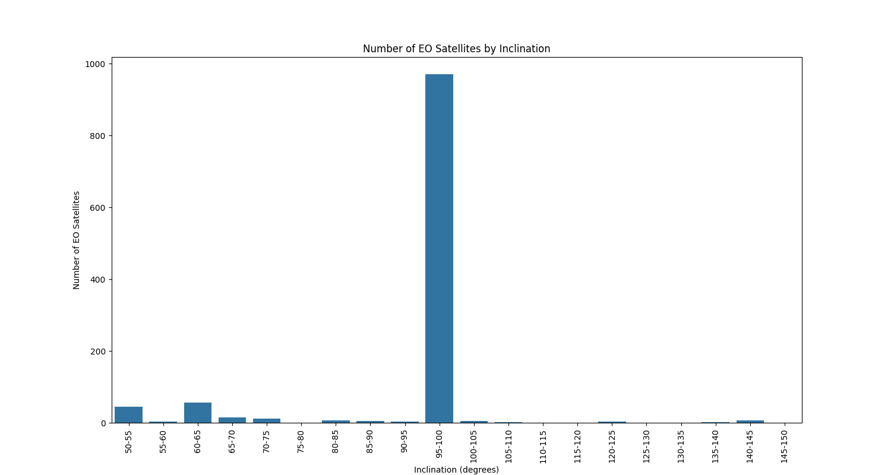

# Determine EO satellites with coverage in the north

Inclination is the angle between a satellite's orbit plane and the equatorial plane of the Earth.

Inclination's over 90's are technically in retrograde orbit, but practically in a Sun-Synchronous Orbit. This allows for constant illumination on the Earth's surface. This is advantages for EO applications.

